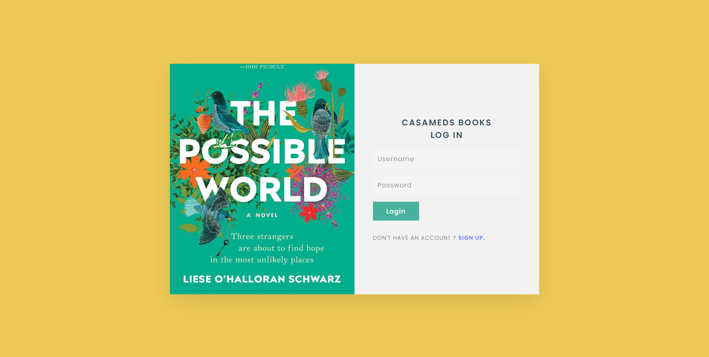

# casameds-book-store
A desktop app to login/sign-up and order a book       

[]()     
</br>
## [Download Windows app](https://github.com/atiqg/casameds-book-store/releases/latest/download/atiqgauri-casameds-win32-v1.0.0.exe)              

## Assignment:           
[✔️] - order a book     
[✔️] - selected book will be delivered to user's email address    
[✔️] - API for customer registration    
[✔️] - generate unique 6 digit ID for each user    
[✔️] - database of all registered user (firebase)     
[✔️] - reflect UID code in app post registration     
[✔️] - bundle app     
[✔️] - send data model     
[✔️] - send source code     
</br>

## Installation: 
```
git clone https://github.com/atiqg/casameds-book-store.git
cd casameds-book-store
npm install
npm start
```
